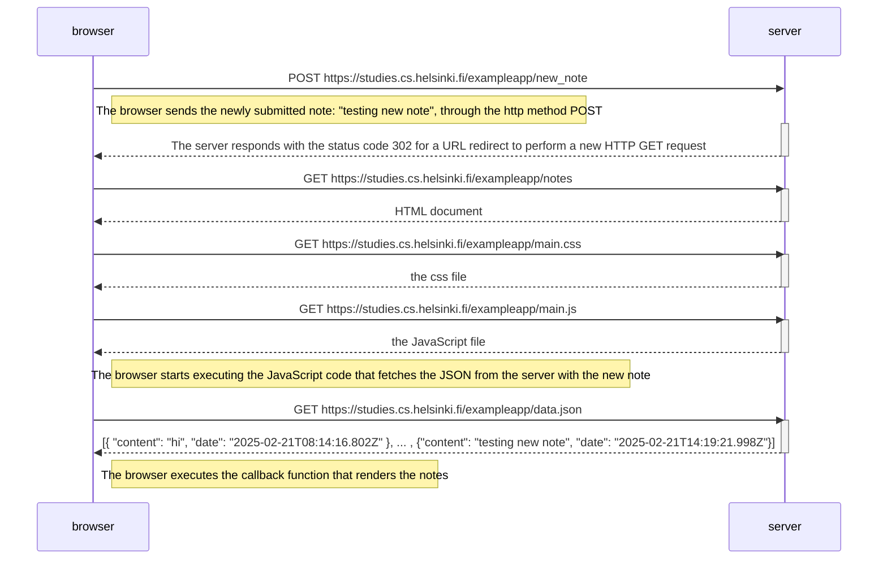

```mermaid
sequenceDiagram
    participant browser
    participant server

    browser->>server: POST https://studies.cs.helsinki.fi/exampleapp/new_note
    Note right of browser: The browser sends the newly submitted note: "testing new note", through the http method POST 
    activate server
    server-->>browser: The server responds with the status code 302 for a URL redirect to perform a new HTTP GET request
    deactivate server
    browser->>server: GET https://studies.cs.helsinki.fi/exampleapp/notes
    activate server
    server-->>browser: HTML document
    deactivate server

    browser->>server: GET https://studies.cs.helsinki.fi/exampleapp/main.css
    activate server
    server-->>browser: the css file
    deactivate server

    browser->>server: GET https://studies.cs.helsinki.fi/exampleapp/main.js
    activate server
    server-->>browser: the JavaScript file
    deactivate server

    Note right of browser: The browser starts executing the JavaScript code that fetches the JSON from the server with the new note

    browser->>server: GET https://studies.cs.helsinki.fi/exampleapp/data.json
    activate server
    server-->>browser: [{ "content": "hi", "date": "2025-02-21T08:14:16.802Z" }, ... , {"content": "testing new note", "date": "2025-02-21T14:19:21.998Z"}]
    deactivate server

    Note right of browser: The browser executes the callback function that renders the notes
```