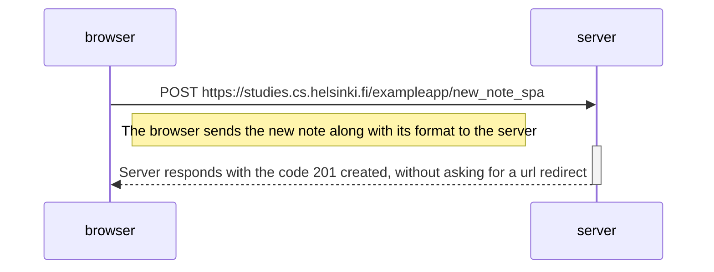

```mermaid
sequenceDiagram
    participant browser
    participant server

    browser->>server: POST https://studies.cs.helsinki.fi/exampleapp/new_note_spa
    Note right of browser: The browser sends the new note along with its format to the server
    activate server
    server-->>browser: Server responds with the code 201 created, without asking for a url redirect
    deactivate server
```